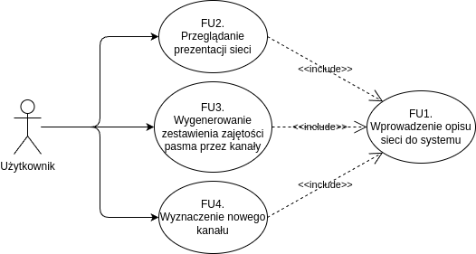
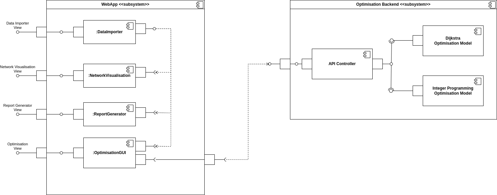

<!-- pandoc architecture.md -o architecture-draft.pdf --toc -V geometry:margin=0.5in -V graphics:maxheight=2in -->

# Opis architektury
Opis architektury projektu w modelu 4+1

## Scenariusze
Przypadki użycia opisane w punkcie 3.3.

## Widok logiczny

* Użytkownik (analityk) korzysta z interfejsów do
    * wprowadzania opisu sieci do systemu
    * przeglądania prezentacji sieci
    * generowania raportu zajętości pasma przez kanały
    * wyznaczanie nowego kanału z użyciem modelu optymalizacyjnego
* System dostarcza 2 modeli optymalizacyjnych
    * oparty o algorytm Dijkstry
    * oparty o model programowania całkowitoliczbowego
* Pojęcia użyta w modelu sieci są objasnione w punkcie 1.1

## Widok procesu

Diagram przedstawia typowe użycie systemu

* Użytkownik zaczyna od wprowadzenia opisu sieci
* Użytkownik ustala parametry pożądanego kanału i modelu optymalizacyjnego
* Użytkownik czeka na wynik modelu
* Użytkownik może przeglądać prezentację sieci z nowym kanałem lub wygenerować raport

## Widok implementacji

* Aplikacja webowa dostarcza widoków użytkownika do
    * importu opisu sieci z plików .csv
    * przeglądania graficznej prezentacji sieci (wizualizacja sieci i podgląd statystyk wybranych elementów)
    * generowania raportów w formacie .csv
    * korzystania z modeli optymalizacyjnych
* Modele optymalizacyjne są zaimplementowane po stronie serwera
    * API Controller przyjmuje żądania, zleca przeprowadzenie optymalizacji i odsyła wynik

W implementacji podsystemu `WebApp` planujemy wykorzystać framework React (Typescript) i bibliotekę do wizualizacji grafów (do ustalenia).

W implementacji podsystemu `OptimisationBackend` planujemy wykorzystać framework FastAPI (Python), bibliotekę Pyomo oraz solwer dla modeli programowania całkowitoliczbowego (do ustalenia).

## Widok fizyczny

* Aplikacja będzie wdrożona na jednym serwerze
    * przyjmujemy roboczo, że będzie to Raspberry Pi
* Aplikacja jest uruchamiana w środowisku Docker
* Kontener `backend`
    * artefakty stanowi kod źródłowy aplikacji wykorzystującej framework FastAPI i implementacji modeli optymalizacyjnych
    * realizuje funkcje podsystemu `Optimisation Backend`
* Kontener `web-server`
    * serwer HTTP Nginx
    * serwuje aplikację webową realizującą funkcje podsystemu `WebApp`
    * służy jako reverse proxy dla klientów komunikujących się z podsystemem `Optimisation Backend`
    * artefakty stanowi kod zbudowanej aplikacji webowej oraz pliki konfiguracyjne serwera Nginx
* Kontenery będą połączone w jednym *docker network*
* Schemat komunikacji klient-serwer
    * klient wysyła żądanie użycia modelu optymalizacyjnego z danymi wejściowymi (opis sieci, opis żądanego kanału)
    * serwer odpowiada, że przyjął żądanie
    * serwer uruchamia model optymalizacyjny (czas przetwarzania rzędu kilku minut)
    * serwer odsyła klientowi wynik optymalizacji (parametry nowego kanału)

Ze względu na długi czas przetwarzania po stronie serwera, chcemy zastosować protokół WebSockets, który umożliwi dwustronną komunikację, w której serwer odeśle wynik, kiedy będzie gotowy. W ten sposób unikniemy cyklicznego odpytywania serwera przez klienta (polling).

