<!-- 
pandoc master.md -o master.pdf \
    --pdf-engine=xelatex \
    --toc \
    --toc-depth=2 \
    --number-sections \
    -V geometry:margin=0.5in \
    -V lang=polish \
    -V babel-lang=polish
-->

---
title: "Sieć"
subtitle: "Dokumentacja projektowa PZSP2"
date: "2024-11-30"
titlepage: true
titlepage-color: "FFFFFF"
titlepage-text-color: "000000"
titlepage-rule-color: "000000"
titlepage-rule-height: 2
---

\newpage

# Wprowadzenie

**Wersja 1.2**

**Zespół nr 2 w składzie**

* Maksym Bieńkowski
* Mikołaj Garbowski
* Michał Łuszczek
* Krzysztof Sokół

**Mentor zespołu: mgr. inż. Klara Borowa**

**Właściciel tematu: dr. inż. Stanisław Kozdrowski**

## Cel projektu {#project-goal}
Celem jest stworzenie aplikacji wspomagającej optymalizację bieżącego ruchu w realistycznej sieci 
teleinformatycznej. Podstawowym zadaniem jest odzwierciedlenie aktualnej zajętości pasma w sieci 
optycznej na podstawie plików z baz danych: w postaci arkusza kalkulacyjnego, jak i w postaci graficznej 
na modelu topologicznym sieci (mapa zajętości). W przeciwieństwie do technologii fixed grid, która 
zakłada równomierny podział pasma między kanały, stosowany model flex grid umożliwia zmienny 
przydział jednostek nazywanych slice'ami. Pozwala to na minimalizację marnowanego pasma, co 
prowadzi do zmniejszenia kosztów dzierżawy włókien przesyłowych. Problem optymalnej rozbudowy 
sieci należy do kategorii NP-trudnych. Naszym celem jest stworzenie aplikacji ułatwiającej zarządzanie 
taką siecią.

**Głównymi celami są**

* czytelna reprezentacja sieci w postaci grafu
* możliwość zestawienia nowych kanałów i automatyczny dobór optymalnych tras zapewniających 
równomierne obciążenie sieci
* generowanie raportów zajętości slice'ów w postaci plików csv
* zaproponowanie modelu w postaci matematycznej, zawierającego funkcję celu (kosztu) oraz zbioru ograniczeń, optymalizującego pasmo oraz ruting nowo-zestawianych kanałów (ścieżek) optycznych w sieci

**Słowik pojęć**

* pasmo - zakres częstotliwości światła, na którym przesyłane są dane
* slice’y - kawałki pasma o różnej rozpiętości częstotliwościowej
* krawędź - para włókien optycznych dzierżawionych przez firmę telekomunikacyjną
* kanał - ścieżka między dwoma wierzchołkami zajmująca tę samą grupę slice'ów na każdej krawędzi
* wierzchołek - punkt rozdzielczy sieci telekomunikacyjnej


## Wstępna wizja projektu

Projekt realizowany jako aplikacja sieciowa.

**Tryb Działania**

* Użytkownik ma do dyspozycji interfejs, na którym wyświetlana jest sieć w postaci grafu.
* Dla polepszenia czytelności graf nałożony będzie na mapę, przez co łatwo będzie identyfikować połączenia.
* Interfejs użytkownika udostępnia narzędzia do modyfikacji modelu sieci i parametrów modeli optymalizacyjnych.
* System dostarcza modeli optymalizacyjnych do wyznaczania nowych kanałów w sieci.

**Dane**

Danymi w projekcie są:

* dostarczony przez użytkownika plik zawierający koordynaty punktów rozdzielczych, istniejące połączenia i kanały
* wewnętrzna reprezentacja grafowa sieci
* wygenerowany raport w formacie csv z informacjami o zajętości slice'ów - informacje o połączeniu, slice i czy jest obecnie używany

System nie będzie trwale przechowywać danych.

\newpage
## Model programowania całkowitoliczbowego

### Zbiory i indeksy
\begin{align*}
	 & N: \text{zbiór węzłów (wierzchołków).}                      \\
	 & E \subseteq N \times N: \text{zbiór skierowanych krawędzi.} \\
	 & K = \{0,1,\dots,767\}: \text{zbiór indeksów slice'ów.}
\end{align*}

### Parametry

\begin{align*}
	& w_{ij}
	& & \text{koszt (waga) użycia krawędzi }(i,j)\in E.\\
	&   & & \text{Wyliczanie wartości wagi rozwiązywane jest poza modelem całkowitoliczbowym} \\
	&   & & \text{i jest częścią wspólną logiki stosowanych optymalizatorów.} \\
	& s \in N
	& & \text{wierzchołek źródłowy (source).} \\
	& t \in N
	& & \text{wierzchołek docelowy (target).} \\
	& \text{O}_{(i,j),k} \in \{0,1\}
	& & \text{parametr binarny wskazujący, czy slice }k \text{ jest zajęty (}1\text{)} \\
	&   & & \text{czy wolny (}0\text{) na krawędzi }(i,j). \\
	& S \in \mathbb{Z}_{\ge 0}
	& & \text{liczba \emph{ciągłych} slice'ów wymagana na każdej wybranej krawędzi.}
\end{align*}

### Zmienne decyzyjne

\begin{align*}
	 & x_{ij} \in \{0,1\}
	 &                         & \text{równe }1\text{, jeśli krawędź }(i,j)\text{ jest użyta w ścieżce; }0\text{ w p.p.}                                               \\
	 & y_{k} \in \{0,1\}
	 &                         & \text{równe }1\text{, jeśli slice }k \text{ jest wybrany jako \emph{początek} }                                                       \\
	 &                         &                                                                                         & \text{ciągłego przedziału; }0\text{ w p.p.} \\
	 & z_{(i,j),k} \in \{0,1\}
	 &                         & \text{zmienna pomocnicza do powiązania }x_{ij} \text{ i } y_k.
\end{align*}

### Funkcja celu

$$
	\min \sum_{(i,j)\in E} w_{ij} \, x_{ij}.
$$

Jej celem jest zminimalizowanie łącznego kosztu (wagi) wszystkich wybranych krawędzi.
Obliczanie wagi jest wspólne dla obu modeli optymalizacyjnych, dlatego nie jest ujęta w samym modelu całkowitoliczbowym.
Waga krawędzi to suma ważona jej długości (na podstawie współrzędnych geograficznych) oraz obciążenia, gdzie wagi w tej 
sumie są parametrami użytkownika.

\newpage
### Ograniczenia

#### Zachowanie przepływu
$$
    \forall\, n \in N: \quad
    \sum_{\substack{(n,j)\in E}} x_{n j}
    \;-\;
    \sum_{\substack{(i,n)\in E}} x_{i n}
    =
    \begin{cases}
        1  & \text{jeśli } n = s,       \\
        -1 & \text{jeśli } n = t,       \\
        0  & \text{w przeciwnym razie}.
    \end{cases}
$$

Zapewnia to, że ze źródła wypływa dokładnie 1 jednostka przepływu, do ujścia wpływa 1 jednostka, a pozostałe węzły mają 
bilans zerowy (co definiuje ścieżkę od $s$ do $t$).

#### Dostępność wolnych slice'ów na każdej wybranej krawędzi

$$
    \forall\,(i,j) \in E:\quad
    \sum_{\substack{k \in K \\ k + S - 1 \,\le\, \max(K)}}
    \Biggl(
    y_k \cdot
    \prod_{r = k}^{k + S - 1} \bigl[1 - \text{O}_{(i,j),r}\bigr]
    \Biggr)
    \;\;\ge\;\; x_{ij}.
$$

Dla każdej krawędzi $(i,j) \in E$ musi istnieć co najmniej jeden indeks początkowy $k$, 
dla którego (1) slice'y od $k$ do $k+S-1$ są wolne oraz (2) $y_k=1$. 

Jeśli $x_{ij} = 1$, to co najmniej jeden blok $S$ kolejnych wolnych slice'ów (począwszy od pewnego $k$) musi być dostępny.

#### Zgodność wybranego slice'a z istniejącym zajęciem

$$
    \forall\,(i,j)\in E,\;\forall\,k \in K: \;
    \begin{aligned}
         & \text{jeśli }(k + S - 1) > \max(K),\quad \text{pomijamy;}              \\
         & \text{w przeciwnym razie } z_{(i,j),k} \;\le\; 1 - \text{O}_{(i,j),k}.
    \end{aligned}
$$

Jeżeli slice $k$ jest zajęty na krawędzi $(i,j)$, to zmienna $z_{(i,j),k}$ musi wynosić 0.

#### Powiązanie zmiennych $z_{(i,j),k}$ z $x_{ij}$ i $y_k$

$$
    \forall\,(i,j)\in E,\;\forall\,k \in K:\quad
    \begin{cases}
        z_{(i,j),k} \;\le\; y_k,    \\
        z_{(i,j),k} \;\le\; x_{ij}, \\
        z_{(i,j),k} \;\ge\; y_k + x_{ij} - 1.
    \end{cases}
$$
Jest to standardowe odwzorowanie równości
$$
    z_{(i,j),k} = x_{ij} \cdot y_k.
$$

#### Wzajemna wyłączność wybranego slice'a początkowego

$$
    \sum_{\substack{k \in K \\ k + S - 1 \,\le\, \max(K)}}
    y_k
    \;=\; 1.
$$
Dokładnie jeden slice $k$ zostaje wybrany jako początek bloku długości $S$.

\newpage

# Metodologia wytwarzania

* Praca, poza określonymi w harmonogramie konsultacjami, organizowana jest w formie zwinnej.
* Przewidziane są cotygodniowe spotkania zdalne w ramach zespołu, w trakcie których członkowie ustalają priorytety i dzielą się zadaniami.
* Przydział zadań widoczny jest na Github w postaci issues.
* Dodatkowo dostępna jest ciągła komunikacja na platformie discord.

Role w zespole według podziału Belbina

* Mikołaj Grabowski - Shaper, Implementer, Team worker
* Maksym Bieńkowski - Implementer, Resource Investigator, Team Worker
* Michał Łuszczek - Coordinator, Implementer, Team Worker
* Krzysztof Sokół - Implementer, Evaluator

\newpage

# Analiza wymagań {#requirements-analysis}

## Wymagania użytkownika i biznesowe

**Wymagania biznesowe**

Aktorzy: osoba zarządzająca rozkładem połączeń w sieci

1. Próba minimalizacji kosztów wynikających z dzierżawy włókien przesyłowych
2. Ułatwienie rozszerzania sieci o nowe połączenia
3. Rozwiązanie problemu wyboru optymalnej trasy nowego połączenia
4. Ułatwienie administracji siecią
5. Zapewnienie jak największej niezawodności sieci poprzez równomierne rozłożenie obciążeń pozwalające na poprowadzenie alternatywnego połączenia w przypadku zerwania fizycznych węzłów
6. Rozwiązanie problemu identyfikacji najbardziej obciążonych odcinków sieci


**Wymagania użytkowe**

1. Użytkownik powinien mieć możliwość zdefiniowania sieci poprzez przesłanie pliku zawierającego jej reprezentację
2. Użytkownik powinien mieć możliwość wizualnego podglądu zajętości slice’ów poszczególnych krawędzi w sieci
3. Użytkownik powinien mieć możliwość zdefiniowania nowego kanału w sieci o określonej przepustowości łączącego zadane dwa wierzchołki
4. Użytkownik powinien otrzymać optymalne ułożenie nowego kanału w sieci
5. Użytkownik powinien mieć możliwość pobrać plik reprezentujący zajętość pasma na każdym ze zdefiniowanych kanałów w sieci
6. Dane użytkownika nie powinny być dostępne dla innych użytkowników systemu
7. Użytkownik powinien mieć możliwość zmiany parametrów algorytmu optymalizacyjnego.

**Wymagania systemowe**

1. System powinien udostępnić użytkownikowi graficzną reprezentację sieci w formie grafu
2. System powinien wyświetlać zajętość slice'ów danej krawędzi po naciśnięciu na nią myszką
3. System powinien wyświetlać krawędzie w różnych kolorach reprezentujących zajętość pasma
4. System powinien ustalać optymalne ułożenie nowo zdefiniowanego kanału
5. System powinien udostępniać optymalizację ułożenia dodawanego kanału przy pomocy algorytmu Dijkstry
6. System powinien udostępniać optymalizację ułożenia dodawanego kanału przy pomocy modelu całkowitoliczbowego
7. System powinien umożliwić wyeksportowanie reprezentacji sieci w pliku CSV w następującym formacie:
    * Wierszowi tabeli odpowiada pojedynczy kanał
    * Kolumnie tabeli odpowiada pojedynczy slice
    * Zawartością komórki tabeli jest binarna informacja o zajętości kanału w danej ścieżce
8. Reprezentacja sieci w sesji danego użytkownika powinna być widoczna tylko dla niego
9. System powinien umożliwić zapisanie stanu sieci
10. System powinien umożliwić odtworzenie sieci z wcześniej zapisanego stanu

## Wymagania funkcjonalne i niefunkcjonalne

**Wymagania funkcjonalne**

1. Użytkownik powinien mieć możliwość przesłania pliku w formacie `.csv` zawierającego reprezentację sieci.
2. Aplikacja powinna udostępnić użytkownikowi graficzną reprezentację sieci w postaci grafu.
3. Użytkownik powinien mieć możliwość zdefiniowania nowego kanału w sieci łączącej zadane dwa wierzchołki, określając jego przepustowość.
4. Użytkownik powinien mieć możliwość wyświetlania grafu zrzutowanego na mapę geograficzną obszaru na podstawie współrzędnych poszczególnych węzłów.
5. Aplikacja powinna dynamicznie zmieniać kolor krawędzi grafu w zależności od poziomu zajętości slice'ów tej krawędzi.
6. Użytkownik powinien mieć możliwość podglądu szczegółowych danych dotyczących zajętości slice'ów określonej krawędzi poprzez najechanie na nią kursorem.
7. Ułożenie nowych kanałów określane będzie przy pomocy algorytmu optymalizacyjnego.
8. Aplikacja umożliwia optymalizację ułożenia nowego kanału za pomocą algorytmu Dijkstry.
9. Aplikacja umożliwia optymalizację ułożenia nowego kanału przy użyciu modelu całkowitoliczbowego.
10. Użytkownik powinien mieć możliwość zmiany parametrów algorytmu optymalizacyjnego.

**Wymagania niefunkcjonalne**

1. Aplikacja powinna dostarczać wynik optymalizacji ułożenia kanału w czasie nie dłuższym niż 5 minut dla sieci złożonej z nie więcej niż 300 kanałów.

## Przypadki użycia {#use-cases}

**Biznesowe przypadki użycia**

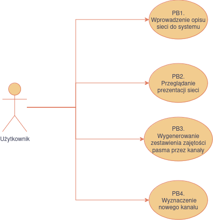

### PB1 Przeglądanie prezentacji sieci

Aktorzy: użytkownik.

Scenariusz główny:

1. System wyświetla graficzną prezentację sieci teletransmisyjnej.
2. System wyświetla zbiorcze statystyki sieci.
3. Użytkownik wybiera element sieci.
4. System wyświetla szczegółowe informacje o elemencie.

### PB2 Wygenerowanie zestawienia zajętości pasma przez kanały

Aktorzy: użytkownik.

Scenariusz główny:

1. Użytkownik wybiera opcję generowania zestawienia dla załadowanej sieci.
2. System generuje zestawienie.
3. Użytkownik pobiera plik z zestawieniem.

### PB3 Wyznaczenie nowego kanału

Aktorzy: użytkownik.

Scenariusz główny:

1. Użytkownik wprowadza parametry dla pożądanego kanału.
2. System prezentuje nowy kanał na wizualizacji sieci.
3. System wyświetla parametry nowego kanału.

Scenariusz alternatywny - system nie może wyznaczyć żądanego kanału:

1. Użytkownik wprowadza parametry dla pożądanego kanału.
2. System informuje użytkownika o niepowodzeniu wyznaczania nowego kanału.
3. System umożliwia ponowne wprowadzenie parametrów - powrót do kroku 1.


**Systemowe przypadki użycia**

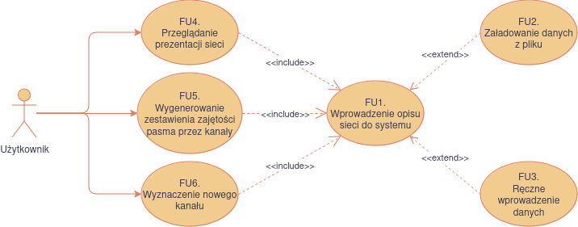

### FU1 Wprowadzenie opisu sieci do systemu

Aktorzy: użytkownik.

Scenariusz główny:

1. Użytkownik otwiera widok wprowadzania danych.
2. Użytkownik wybiera plik z opisem sieci (RB1).
3. Użytkownik potwierdza, że chce nadpisać aktualnie załadowaną w systemie sieć.
4. System informuje użytkownika o poprawnym załadowaniu pliku.
5. System wyświetla widok prezentacji załadowanej sieci.

Scenariusz alternatywny - nieprawidłowy plik:

1. Jak w scenariuszu głównym.
2. System informuje użytkownika o nieprawidłowym formacie pliku.
3. System wyświetla informację o akceptowanych formatach (RB1).
4. System umożliwia ponowny wybór pliku - powrót do kroku 1.

### FU2 Przeglądanie prezentacji sieci

Wspiera procedurę PB1 - Przeglądanie prezentacji sieci.

Korzysta z FU1.

Aktorzy: użytkownik.

Scenariusz główny:

1. Użytkownik wprowadza opis sieci za pomocą funkcji FU1.
2. Użytkownik otwiera widok prezentacji sieci.
3. System wyświetla graficzną prezentację topologii sieci i zajętości pasma w krawędziach.
4. System wyświetla zbiorcze statystyki sieci (RB4).
5. Użytkownik wybiera element sieci (węzeł, krawędź, kanał).
6. System wyświetla parametry elementu (RB2, RB3, RB5).

### FU3 Wygenerowanie zestawienia zajętości pasma przez kanały

Wspiera procedurę PB2 - Wygenerowanie zestawienia zajętości pasma przez kanały.

Korzysta z FU1.

Aktorzy: użytkownik.

Scenariusz główny:

1. Użytkownik wprowadza do systemu opis sieci za pomocą funkcji FU1.
2. Użytkownik wybiera widok generowania zestawienia.
3. System generuje plik w ustalonym formacie (RB6).
4. Użytkownik pobiera plik.

### FU4 Wyznaczenie nowego kanału

Wspiera procedurę PB3 - Wyznaczenie nowego kanału.

Korzysta z funkcji FU1.

Aktorzy: użytkownik.

Scenariusz główny:

1. Użytkownik wprowadza opis sieci do systemu za pomocą funkcji FU1.
2. Użytkownik wybiera widok wyznaczania kanału.
3. Użytkownik wybiera model optymalizacyjny (RB7).
4. Użytkownik wprowadza parametry dla modelu (RB7).
5. Użytkownik potwierdza wybór.
6. System sygnalizuje przetwarzanie.
7. System prezentuje znaleziony kanał na wizualizacji.
8. System wyświetla parametry kanału (RB5).

Scenariusz alternatywny - system nie może wyznaczyć żądanego kanału:

1. Jak w scenariuszu głównym.
2. Jak w scenariuszu głównym.
3. Jak w scenariuszu głównym.
4. Jak w scenariuszu głównym.
5. System informuje użytkownika o niepowodzeniu i jego przyczynie.
6. System umożliwia zmianę parametrów i podobną próbę - powrót do kroku 4.

### Reguły biznesowe

### RB1 Format plików opisujących sieć teletransmisyjną
* Pliki w formacie .csv
* Pierwszy wiersz zawiera nazwy kolumn

#### Węzły sieci (kolumny)
* ID węzła
* Szerokość geograficzna (stopnie)
* Długość geograficzna (stopnie)

#### Krawędzie sieci (kolumny)
* ID krawędzi
* ID węzła początkowego
* ID węzła końcowego
* Szerokość całego dostępnego pasma (stałe 4.8 THz)
* Wykorzystane pasmo (procenty)

#### Kanały sieci (kolumny)
* ID krawędzi
* ID kanału
* Częstotliwość środkowa (THz)
* Szerokość (GHz)
* Długość fali (redundantna, nieużywana)
* Redundantne ID kanału (nieużywane)

### RB2 Parametry węzła sieci
* ID (napis)
* Szerokość geograficzna (liczba rzeczywista)
* Długość geograficzna (liczba rzeczywista)
* ID sąsiadów (lista napisów)

### RB3 Parametry krawędzi sieci
* ID (napis)
* ID węzła 1 (napis)
* ID węzła 2 (napis)
* Szerokość całego dostępnego pasma (napis)
* Wykorzystane pasmo w procentach (liczba całkowita)

### RB4 Zbiorcze statystyki sieci
* Liczba węzłów
* Liczba krawędzi
* Liczba kanałów
* Całkowite obciążenie sieci (procenty)
* Najbardziej obciążony kanał

### RB5 Parametry kanału
* ID (napis)
* ID kolejnych węzłów na ścieżce (lista napisów)
* ID kolejnych krawędzi na ścieżce (lista napisów)
* Częstotliwość środkowa w THz (liczba rzeczywista)
* Szerokość w GHz (liczba rzeczywista)

### RB6 Format pliku z zestawieniem zajmowanych slice'ów przez kanały
* Wiersz 1 - częstotliwości środkowe kanałów 112.5 GHz
* Wiersz 2 - częstotliwości środkowe kanałów 50 GHz
* Wiersz 3 - częstotliwości środkowe kanałów 75 GHz
* Wiersz 4 - częstotliwość początkowa slice'a szerokości 6.25 GHz
* Kolumna 1 - ID kanału
* Komórki - wartość 1, jeśli slice jest zajęty przez kanał, pusta w przeciwnym wypadku

### RB7 Dostępne modele optymalizacyjne i ich parametry
* Dostępne modele:
  * algorytm Dijkstry
  * model całkowitoliczbowy
* Parametry modelu (jednakowe dla obu)
  * ID węzła początkowego
  * ID węzła końcowego
  * przepustowość kanału w Gb/s
  * wagi funkcji celu (kosztu) dla poszczególnych kryteriów - długość i obciążenie krawędzi

## Potwierdzenie zgodności wymagań


\newpage

# Definicja architektury

Opis architektury projektu w modelu 4+1

## Scenariusze
Przypadki użycia opisane w punkcie \ref{use-cases} dokumentacji.

## Widok logiczny

* Rysunek \ref{fig:logical-view} przedstawia diagram klas
* Użytkownik (analityk) korzysta z interfejsów do
    * wprowadzania opisu sieci do systemu
    * przeglądania prezentacji sieci
    * generowania raportu zajętości pasma przez kanały
    * wyznaczanie nowego kanału z użyciem modelu optymalizacyjnego
* System dostarcza 2 modeli optymalizacyjnych
    * oparty o algorytm Dijkstry
    * oparty o model programowania całkowitoliczbowego
* Pojęcia użyte w modelu sieci są objaśnione w punkcie \ref{project-goal} dokumentacji

## Widok procesu

* Diagram \ref{fig:process-view} przedstawia typowe użycie systemu
* Użytkownik zaczyna od wprowadzenia opisu sieci
* Dla załadowanej sieci użytkownik może
    * obejrzeć jej wizualizację i przeglądać parametry jej elementów
    * wygenerować raport na podstawie aktualnie załadowanej sieci
    * zestawić nowy kanał w sieci wykorzystując model optymalizacyjny 

## Widok implementacji

* Rysunek \ref{fig:development-view} przedstawia diagram komponentów
* Aplikacja webowa dostarcza widoków użytkownika do
    * importu opisu sieci z plików .csv
    * przeglądania graficznej prezentacji sieci (wizualizacja sieci i podgląd statystyk wybranych elementów)
    * generowania raportów w formacie .csv
    * korzystania z modeli optymalizacyjnych
* Modele optymalizacyjne są zaimplementowane po stronie serwera
    * API Controller przyjmuje żądania, zleca przeprowadzenie optymalizacji i odsyła wynik

W implementacji podsystemu `WebApp` planujemy wykorzystać framework React (Typescript) i bibliotekę 
do wizualizacji grafów (do ustalenia).

W implementacji podsystemu `OptimisationBackend` planujemy wykorzystać framework FastAPI (Python), 
bibliotekę Pyomo oraz solwer dla modeli programowania całkowitoliczbowego (do ustalenia). 

Do zweryfikowania pozostaje kwestia, czy istnieje solwer na licencji Open Source, który obsłuży 
nasz model całkowitoliczbowy i zbiór danych.
Alternatywnie możemy wykorzystać oprogramowanie AMPL, w środowisku chmurowym dostępnym dla PW, 
na który licencję może udostępnić nam właściciel tematu.

## Widok fizyczny

* Rysunek \ref{fig:physical-view} przedstawia diagram wdrożenia
* Aplikacja będzie wdrożona na jednym serwerze
    * przyjmujemy roboczo, że będzie to Raspberry Pi
* Aplikacja jest uruchamiana w środowisku Docker
* Kontener `backend`
    * artefakty obejmują kod źródłowy aplikacji wykorzystującej framework FastAPI oraz implementację modeli optymalizacyjnych.
    * realizuje funkcje podsystemu `Optimisation Backend`
* Kontener `web-server`
    * serwer HTTP Nginx
    * serwuje aplikację webową realizującą funkcje podsystemu `WebApp`
    * służy jako reverse proxy dla klientów komunikujących się z podsystemem `Optimisation Backend`
    * artefakty to kod zbudowanej aplikacji webowej oraz pliki konfiguracyjne serwera Nginx
* Kontenery będą połączone w jednym *docker network*
* Schemat komunikacji klient-serwer
    * klient wysyła żądanie użycia modelu optymalizacyjnego z danymi wejściowymi (opis sieci, opis żądanego kanału)
    * serwer odpowiada, że przyjął żądanie
    * serwer uruchamia model optymalizacyjny (czas przetwarzania rzędu kilku minut)
    * serwer odsyła klientowi wynik optymalizacji (parametry nowego kanału)

Ze względu na długi czas przetwarzania po stronie serwera, chcemy zastosować protokół WebSockets, 
który umożliwi dwustronną komunikację, w której serwer odeśle wynik, kiedy będzie gotowy. 
W ten sposób unikniemy cyklicznego odpytywania serwera przez klienta (polling).

Powyższy plan wymagałby zmiany, jeśli skorzystamy z licencji na program AMPL w środowisku 
OpenStack Zakładu Sztucznej Inteligencji Instytutu Informatyki (planujemy jednak, o ile to możliwe, 
wykorzystać rozwiązania Open Source).

{#fig:logical-view}

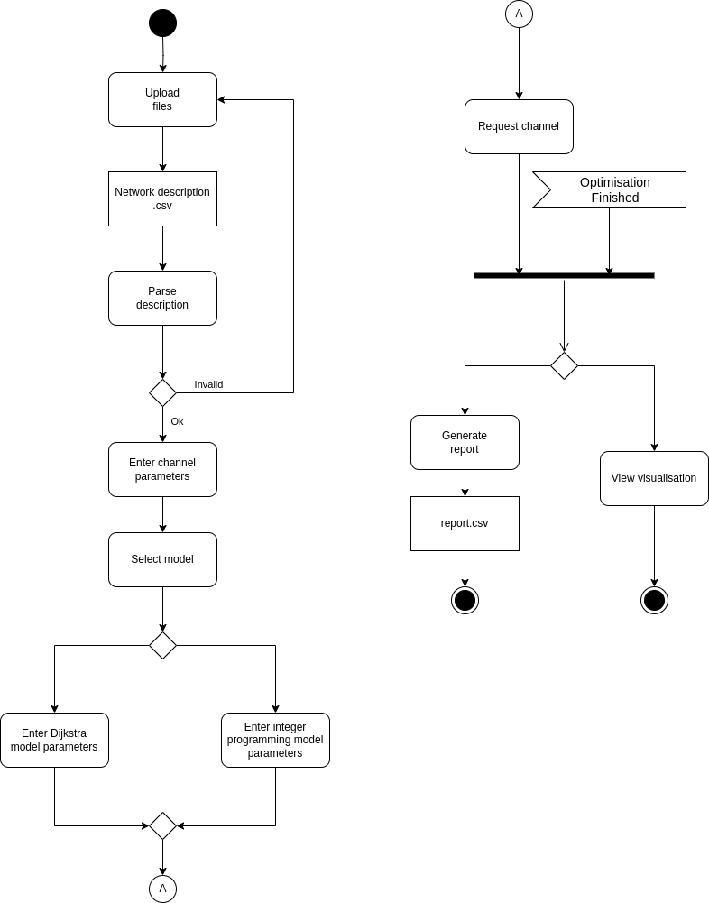{#fig:process-view}

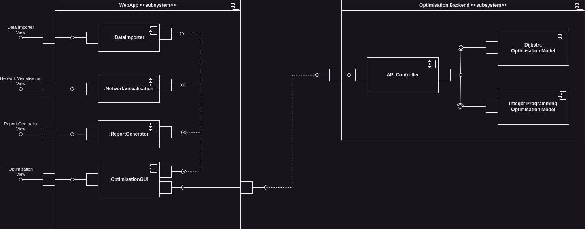{#fig:development-view}

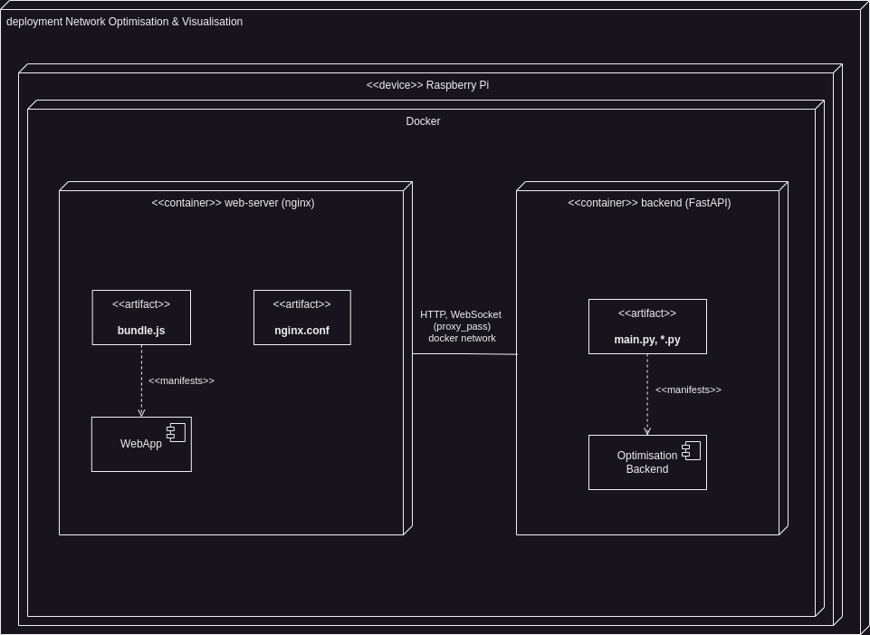{#fig:physical-view}

\newpage

# Dane trwałe
W naszym projekcie nie przewidujemy użycia bazy danych.

Model sieci teleinformatycznej (wraz ze wszystkimi zmianami) będzie przechowywany po stronie aplikacji przeglądarkowej 
do momentu zamknięcia lub odświeżania strony. Po tym okresie konieczne będzie ponowne wgranie opisu. 
Po stronie serwera nie są przechowywane stale żadne dane. Działa on jak funkcja, która otrzymuje model sieci 
i parametry optymalizatora, oblicza optymalną trasę kanału, zwraca ją aplikacji przeglądarkowej, 
a następnie usuwa te dane, wracając do stanu początkowego.

Formaty plików wejściowych są opisane w punkcie \ref{requirements-analysis}.

\newpage

# Specyfikacja analityczna i projektowa

## Repozytorium kodu źródłowego
[https://github.com/mGarbowski/pzsp2-projekt](https://github.com/mGarbowski/pzsp2-projekt)

## Wykorzystane technologie
* Języki programowania
  * Python
  * Typescript
* Biblioteki
  * FastAPI
  * Pyomo
  * cbc
  * React
  * Reagraph
* Frameworki testowe
  * pytest
  * Jest
* Środowisko uruchomieniowe - Docker
* System kontroli wersji - Git
* System uruchamiania aplikacji, testów, narzędzi pomocniczych, zarządzania zależnościami
  * npm (frontend)
  * pdm (backend)
* Środowisko ciągłej integracji - GitHub Actions
* Narzędzia do komunikacji i zarządzania projektem
  * Discord
  * GitHub (Issues, Pull Requests)

## Diagram klas

### Backend
{#fig:backend-models}

* Diagram \ref{fig:backend-models} przedstawia klasy z modułu `models`
* Klasy modelują strukturę sieci teleinformatycznej oraz format zapytań i odpowiedzi API optymalizatora
* W implementacji wykorzystujemy bibliotekę Pydantic do walidacji oraz serializacji JSON

{#fig:backend-optimization}

* Diagram \ref{fig:backend-optimization} przedstawia klasy z modułu `optimisation`
* `Optimizer` to abstrakcyjna klasa bazowa dla konkretnych modeli optymalizacyjnych
* `DijkstraOptimizer` i `IntegerProgrammingOptimizer` to konkretne implementacje modeli optymalizacyjnych
* Dla lepszej czytelności kodu źródłowego stosujemy aliasy typów, co jest widoczne w sygnaturach metod

### Frontend

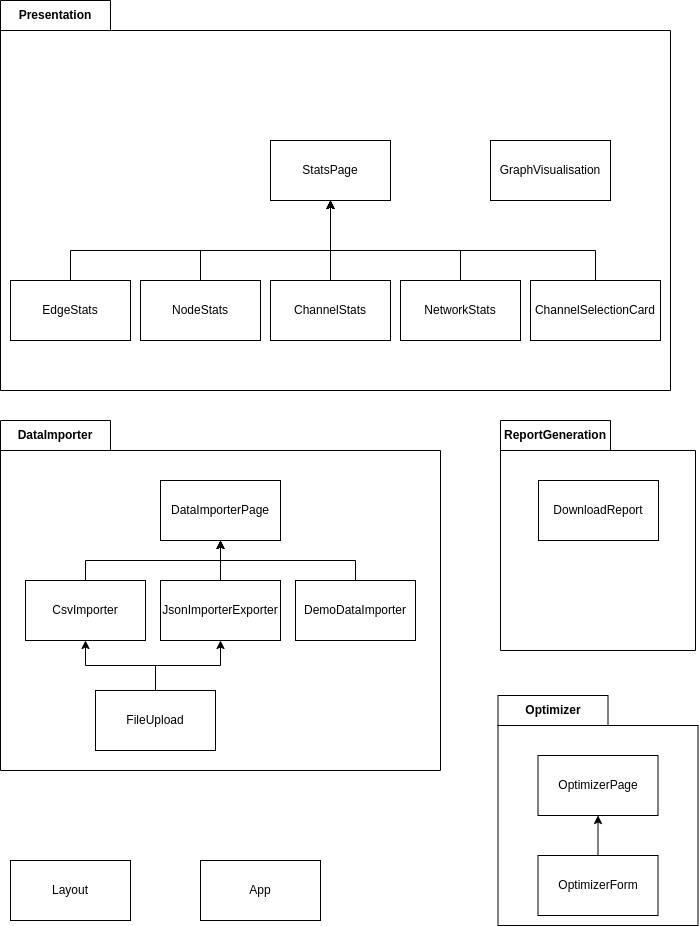{#fig:frontend-components}

* Diagram \ref{fig:frontend-components} przedstawia klasy komponentów React z podziałem na katalogi, w których się znajdują
* Komponenty są zorganizowane w katalogach odpowiadających ich funkcjonalności
* Na diagramie nie zostały przedstawione komponenty pomocnicze, takie jak stylowane przyciski czy pola tekstowe

{#fig:frontend-network}

* Diagram \ref{fig:frontend-network} przedstawia klasy z modułu `network`
* Moduł ten zawiera interfejsy modelujące sieć teleinformatyczną
* Model w aplikacji frontendowej jest analogiczny do modelu przedstawionego na diagramie \ref{fig:backend-models}


## Statystyki
<!--
Liczba plików
sum=$(( $(find backend/src -type f \( -name "*.py" \) | wc -l) + $(find backend/tests -type f \( -name "*.py" \) | wc -l) + $(find frontend/src -type f \( -name "*.ts" -o -name "*.tsx" \) | wc -l) ))
echo $sum

Liczba linii kodu
find frontend/src -name "*.tsx" | xargs wc -l | tail -n 1
find frontend/src -name "*.ts" | xargs wc -l | tail -n 1
find backend/src -name "*.py" | xargs wc -l | tail -n 1

Liczba testów
npm test
pdm test
-->

* Liczba plików z kodem źródłowym: 56
* Liczba linii kodu źródłowego: 3715
* Liczba testów jednostkowych: 33

\newpage

# Projekt standardu interfejsu użytkownika

## Aktorzy

Użytkownik aplikacji - analityk sieci teleinformatycznej w dużej firmie telekomunikacyjnej

## Historyjki użytkownika

1. Jako analityk sieci teleinformatycznej chcę wizualizować istniejący graf połączeń i ich zajętości w sieci, aby łatwo zrozumieć strukturę połączeń i zidentyfikować potencjalne problemy
2. Jako analityk sieci teleinformatycznej chcę, aby optymalne ścieżki nowych kanałów były automatycznie wyznaczane, aby uniknąć ręcznej analizy i zapewnić efektywne wykorzystanie pasma
3. Jako analityk sieci teleinformatycznej chcę łatwo wygenerować raporty o zajętości kanałów w istniejącej sieci, aby monitorować obciążenie sieci i zapobiegać ewentualnym przeciążeniom
4. Jako analityk sieci teleinformatycznej, chcę mieć łatwy i intuicyjny dostęp do danych o obciążeniu dowolnego elementu w sieci, aby zidentyfikować słabe punkty i wąskie gardła systemu.
5. Jako analityk sieci teleinformatycznej, chcę optymalnie wykorzystywać przepustowość sieci, aby zminimalizować koszty ponoszone przez moją firmę i zapewnić, że sieć będzie gotowa na dalsze rozszerzenia.

## Makiety interfejsu użytkownika
Makiety trzech proponowanych widoków w programie Figma dostępne są do pod [(tym URL)](https://www.figma.com/design/LSVdFyCmJqtZo8UsO2cd5q/PZPS2_2024?node-id=0-1&t=1bl4m1dv9aWKn0LJ-1).
Podglądy widoków widoczne są na rysunkach \ref{fig:figma-importer}, \ref{fig:figma-presentation} i \ref{fig:figma-optimizer}.

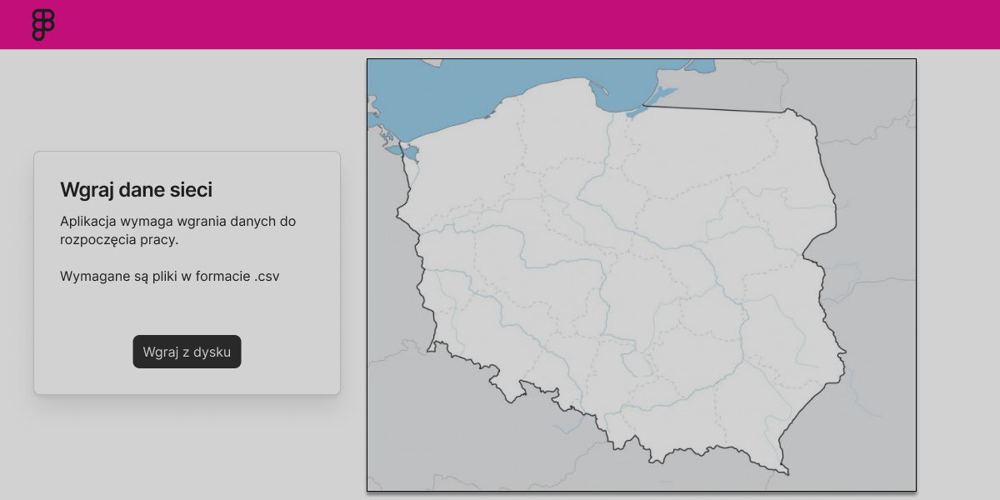{#fig:figma-importer}

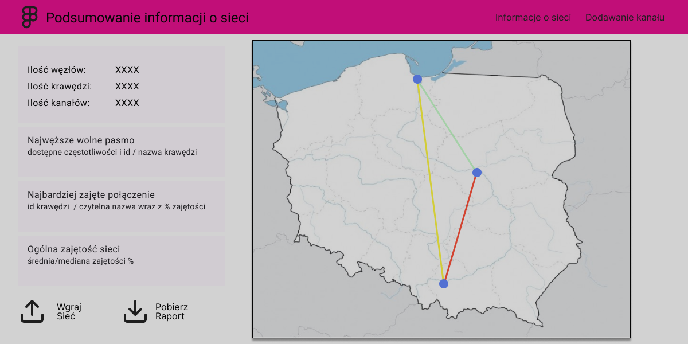{#fig:figma-presentation}

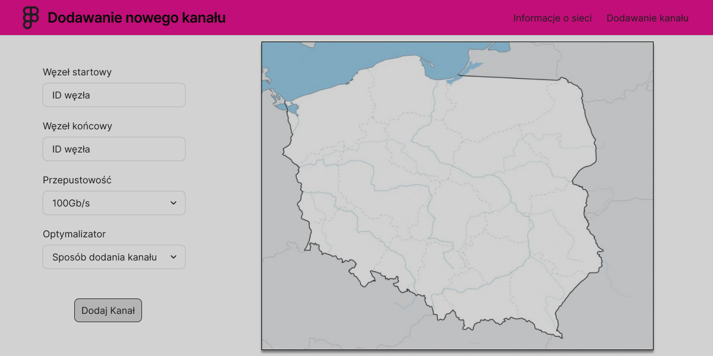{#fig:figma-optimizer}

\newpage
# Specyfikacja testów

## Testy jednostkowe
* W projekcie stosujemy testy jednostkowe do weryfikacji poprawności implementacji pojedynczych modułów w izolacji
* Backend
  * testy jednostkowe dla backendu są zaimplementowane w plikach `test_*.py` w katalogu `backend/tests`
  * do testów wykorzystujemy bibliotekę `pytest`
  * uruchomienie wszystkich testów: `pdm test` w katalogu `backend`
* Frontend
  * testy jednostkowe dla frontendu są zaimplementowane w plikach `*.test.ts`, obok plików `*.ts` które podlegają testowaniu
  * do testów wykorzystujemy bibliotekę `Jest`
  * uruchomienie wszystkich testów: `npm test` w katalogu `frontend`

## Scenariusze testów manualnych
* W projekcie stosujemy testy manualne do weryfikacji poprawności interakcji użytkownika z aplikacją 

### Przygotowanie środowiska
* Pliki z opisem sieci
  * przygotowanie plików .csv z opisem sieci teleinformatycznej (wezly.csv, zajetosc.csv, spectrum_kanaly.csv)
  * pliki zostały dostarczone przez właściciela projektu, nie mogą znajdować się w publicznym repozytorium
  * aplikacja umożliwia też pominięcie krok importu plików, wtedy użytkownik może wchodzić interakcję z demonstracyjną siecią 
* Uruchomienie aplikacji
  * lokalne uruchomienie aplikacji: `docker compose -f docker-compose.local.yml up --build` w katalogu głównym projektu
  * otwarcie przeglądarki i wejście na stronę `http://localhost:2137`
  * lub interakcja z wdrożoną aplikacją na serwerze http://pzsp2.mgrabowski.pl

### Zaimportowanie poprawnego opisu sieci z csv
1. Użytkownik otwiera stronę importera danych (strona startowa)
2. Użytkownik wybiera plik `wezly.csv` z opisem węzłów sieci
3. Użytkownik wybiera plik `zajetosc.csv` z opisem krawędzi sieci
4. Użytkownik wybiera plik `spectrum_kanaly.csv` z opisem kanałów sieci
5. Po wybraniu wszystkich plików pojawia się komunikat o pomyślnym zaimportowaniu sieci
6. Po prawej stronie wyświetla się wizualizacja sieci

### Import i eksport stanu sieci z formatu json
1. Użytkownik otwiera stronę importera danych (strona startowa)
2. Użytkownik wybiera plik `wezly.csv` z opisem węzłów sieci
3. Użytkownik wybiera plik `zajetosc.csv` z opisem krawędzi sieci
4. Użytkownik wybiera plik `spectrum_kanaly.csv` z opisem kanałów sieci
5. Wczytuje się poprawny opis sieci.
6. Użytkownik naciska przycisk "Pobierz" w sekcji "Pobierz lub załaduj stan sieci"
7. Pobiera się plik w formacie json.
8. Użytkownik odświeża stronę.
9. Użytkownik naciska przycisk "Załaduj" w sekcji "Pobierz lub załaduj stan sieci"
10. Użytkownik wybiera wcześniej pobrany plik w formacie json.
11. Wczytuje się ten sam opis sieci.

### Generowanie raportu zajętości pasma przez kanały
1. Użytkownik otwiera stronę prezentacji sieci
2. Użytkownik importuje opis sieci.
3. Użytkownik przechodzi do zakładki "Statystyki"
4. Użytkownik naciska przycisk "Pobierz raport"
5. Przeglądarka pobiera plik .csv z raportem

### Podgląd statystyk sieci i jej elementów
1. Użytkownik otwiera stronę prezentacji sieci
2. Użytkownik importuje opis sieci.
3. Użytkownik przechodzi do zakładki "Statystyki"
4. Na karcie "Sieć" widoczne są globalne statystyki sieci
5. Na karcie "Kanały" widoczna jest lista identyfikatorów kanałów
6. Użytkownik klika na dowolny węzeł na prezentacji sieci
7. Wybrany węzeł wyświetla się w kolorze niebieskim na prezentacji sieci
8. Po lewej stronie widoczna jest karta "Wybrany węzeł" ze statystykami węzła
9. Użytkownik klika na identyfikator dowolnego sąsiada na karcie "Wybrany węzeł"
10. Wybrany sąsiad wyświetla się w kolorze niebieskim na prezentacji sieci
11. Na karcie "Wybrany węzeł" wyświetlają się statystyki wybranego sąsiada
12. Użytkownik klika na dowolną krawędź na prezentacji sieci
13. Wybrana krawędź wyświetla się w kolorze niebieskim na prezentacji sieci
14. Po lewej stronie wyświetla się karta "Wybrana krawędź" ze statystykami krawędzi
15. Użytkownik klika na identyfikator węzła z listy "Łączy węzły" na karcie krawędzi
16. Wybrany węzeł wyświetla się w kolorze niebieskim na prezentacji sieci
17. Użytkownik klika na dowolny identyfikator na karcie "Kanały"
18. Węzły i krawędzie wybranego kanału wyświetlają się w kolorze fioletowym na prezentacji sieci (lub zostały zaznaczone wcześniej i są zielone)
19. Po lewej stronie wyświetla się karta "Wybrany kanał" ze statystykami kanału
20. Użytkownik klika na identyfikator węzła z listy "Węzły" na karcie wybranego kanału
21. Wybrany węzeł wyświetla się w kolorze niebieskim na prezentacji sieci
22. Karta "Wybrany węzeł" wyświetla statystyki wybranego węzła
23. Użytkownik klika na identyfikator krawędzi na liście "Krawędzie" na karcie wybranego kanału
24. Wybrana krawędź wyświetla się w kolorze niebieskim na prezentacji sieci
25. Karta "Wybrana krawędź" wyświetla statystyki wybranej krawędzi

### Wyznaczenie nowego kanału z użyciem modelu programowania całkowitoliczbowego
1. Użytkownik otwiera stronę prezentacji sieci
2. Użytkownik importuje opis sieci.
3. Użytkownik przechodzi do zakładki "Dodaj kanał"
4. Użytkownik odczytuje z prezentacji identyfikator węzła i wpisuje go w pole "Węzeł startowy"
5. Użytkownik odczytuje z prezentacji identyfikator innego węzła i wpisuje go w pole "Węzeł końcowy"
6. Użytkownik wybiera jedną z opcji w polu "Przepustowość"
7. Użytkownik wybiera "Model całkowitoliczbowy" w polu "Optymalizator"
8. Użytkownik wpisuje dodatnie liczby w pola "Waga długości krawędzi" i "Waga obciążenia krawędzi"
9. Użytkownik naciska przycisk "Dodaj kanał"
10. Pojawia się indykator ładowania do czasu otrzymania wyniku
11. Po pewnym czasie, na prezentacji sieci pojawia się wyróżniona kolorem fioletowym ścieżka między zadanymi węzłami
12. Pod formularzem pojawia się komunikat z czasem obliczeń
13. Użytkownik przechodzi do zakładki "Statystyki"
14. Na karcie "Wybrany kanał" widoczne są statystyki i atrybuty nowego kanału

### Wyznaczenie nowego kanału z użyciem modelu Dijkstry
1. Użytkownik otwiera stronę prezentacji sieci
2. Użytkownik importuje opis sieci.
3. Użytkownik przechodzi do zakładki "Dodaj kanał"
4. Użytkownik odczytuje z prezentacji identyfikator węzła i wpisuje go w pole "Węzeł startowy"
5. Użytkownik odczytuje z prezentacji identyfikator innego węzła i wpisuje go w pole "Węzeł końcowy"
6. Użytkownik wybiera jedną z opcji w polu "Przepustowość"
7. Użytkownik wybiera "Algorytm Dijkstry" w polu "Optymalizator"
8. Użytkownik wpisuje dodatnie liczby w pola "Waga długości krawędzi" i "Waga obciążenia krawędzi"
9. Użytkownik naciska przycisk "Dodaj kanał"
10. Pojawia się indykator ładowania do czasu otrzymania wyniku
11. Po pewnym czasie, na prezentacji sieci pojawia się wyróżniona kolorem fioletowym ścieżka między zadanymi węzłami
12. Pod formularzem pojawia się komunikat z czasem obliczeń
13. Użytkownik przechodzi do zakładki "Statystyki"
14. Na karcie "Wybrany kanał" widoczne są statystyki i atrybuty nowego kanału


## Miary jakości testów
* Jako miarę jakości testów jednostkowych przyjmujemy pokrycie linii kodu testami
* Do mierzenia pokrycia wykorzystujemy narzędzia dostarczone przez biblioteki testowe
* Komendy do zmierzenia pokrycia testami:
  * `pdm cov` w katalogu `backend`
  * `npm run coverage` w katalogu `frontend`
* Powyższe komendy wypisują w konsoli statystyki pokrycia całościowe oraz z podziałem na pliki


\newpage
# Wirtualizacja/konteneryzacja
* W projekcie stosujemy konteneryzację, wykorzystujemy środowisko Docker
* Schemat wdrożenia aplikacji jest przedstawiony na rysunku \ref{fig:physical-view}
* Aplikacja składa się z dwóch kontenerów
  * `web-server`
  * `backend`
* Kontenery są uruchamiane w jednej sieci `app-network` (Docker network)
* Przygotowane są oddzielne pliki konfiguracyjne dla środowisk lokalnego i produkcyjnego
  * `docker-compose.local.yml`
  * `docker-compose.prod.yml`
* `web-server`
  * Serwer HTTP i reverse proxy
  * Wykorzystuje obraz `nginx` oraz `node:18` (przy wieloetapowym budowaniu)
  * Serwuje aplikację frontendową
  * Przekierowuje zapytania do aplikacji backendowej (reverse proxy)
  * Oddzielne Dockerfile i plik konfiguracyjny Nginx dla uruchomienia lokalnego i produkcyjnego
* `backend`
  * Aplikacja backendowa, API optymalizatora
  * Wykorzystuje obraz `python:3.12-slim` oparty na systemie Debian
  * Instaluje solwer `cbc` oraz uruchamia aplikację FastAPI

# Bezpieczeństwo

## Zależności
* Zależności są zapisane w plikach `package.json` i `pdm.lock`
* Narzędzie `npm` umożliwia sprawdzenie zależności pod kątem luk bezpieczeństwa
* GitHub Dependabot monitoruje zależności pod kątem znanych podatności

## Bezpieczeństwo aplikacji
* Aplikacje nie przechowuje żadnych danych w sposób trwały
* Aplikacja nie przechowuje danych użytkowników, nie wymaga logowania
* Dane przesyłane do serwera nie mają charakteru poufnego

## Bezpieczeństwo infrastruktury
* Logowanie do serwera wymaga uwierzytelnienia kluczem (SSH)

\newpage
# Podręcznik użytkownika

## Lokalne uruchomienie aplikacji
Aplikację można uruchomić lokalnie, korzystając ze środowiska Docker.
Aplikacja jest również wdrożona w chmurze i dostępna pod adresem [http://pzsp2.mgrabowski.pl](http://pzsp2.mgrabowski.pl).

* [Zainstaluj Docker i Docker Compose](https://docs.docker.com/engine/install/)
* Sklonuj repozytorium: `git clone git@github.com:mGarbowski/pzsp2-projekt.git`
* Przejdź do katalogu projektu: `cd pzsp2-projekt`
* Uruchom aplikację: `docker compose -f docker-compose.local.yml up --build`
* Interfejs użytkownika będzie dostępny w przeglądarce pod adresem [http://localhost:2137](http://localhost:2137)

## Funkcje aplikacji
* Importer danych
  * wczytanie opisu sieci z zestawu plików .csv
  * załadowanie demonstracyjnej sieci
  * eksport stanu sieci do pliku .json
  * import stanu sieci z pliku .json
* Wizualizacja grafu sieci teleinformatycznej
* Prezentacja statystyk i atrybutów sieci i jej elementów
* Generowanie raportu zajętości pasma przez kanały w formacie .csv
* Wyznaczanie nowego kanału z użyciem modelu optymalizacyjnego

## Obsługa aplikacji

### Ładowanie danych
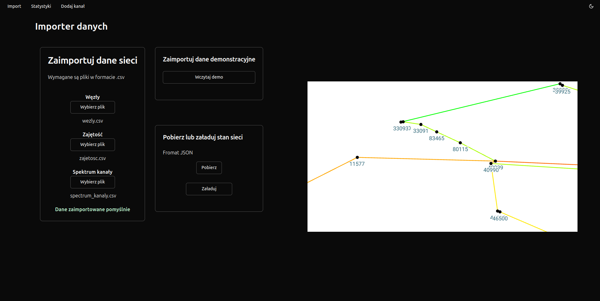{#fig-importer-screenshot}

* Otwórz stronę startową aplikacji (widoczna na zrzucie ekranu \ref{fig-importer-screenshot})
* Podstawowym krokiem jest załadowanie plików .csv z opisem sieci
  * przygotuj pliki "wezly.csv", "zajetosc.csv" i "spectrum_kanaly.csv"
  * na panelu "Zaimportuj dane sieci" wybierz przygotowane pliki w odpowiednich polach
  * po załadowaniu wszystkich plików pojawi się komunikat o sukcesie
* Możesz również pominąć krok importu plików i korzystać z demonstracyjnej sieci
  * aby ją załadować, naciśnij przycisk "Wczytaj demo" na panelu "Zaimportuj dane demonstracyjne"
* Stan załadowanej sieci, np. po wyznaczeniu nowych kanałów z użyciem modeli optymalizacyjnych, można zapisać do pliku JSON
  * naciśnij przycisk "Pobierz" na panelu "Pobierz lub załaduj stan sieci"
  * ten sam plik można następnie załadować, np. po zakończeniu sesji, naciskając przycisk "Załaduj"
* Po załadowaniu sieci w dowolny z wymienionych sposobów, po prawej stronie pojawi się wizualizacja grafu sieci
* Możesz powrócić do tej strony, naciskając "Import" na pasku nawigacyjnym
* Pamiętaj, że system nie przechowuje danych po zamknięciu przeglądarki

### Prezentacja sieci
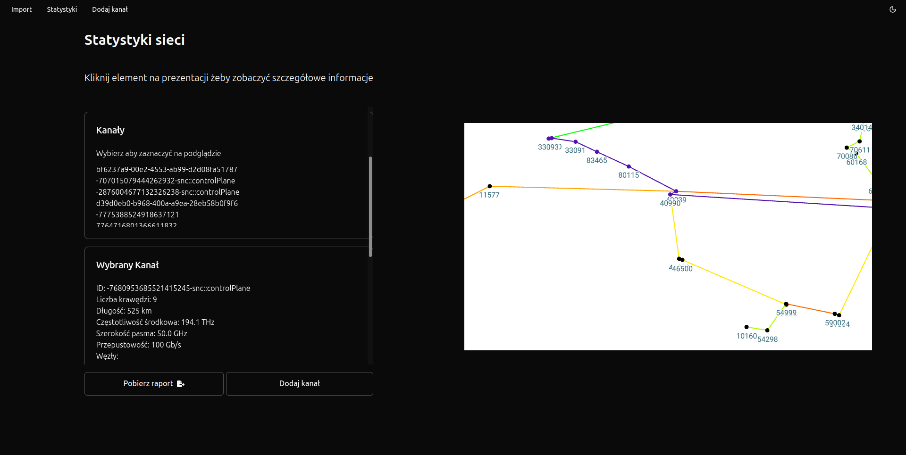{#fig-presentation-screenshot}

* Po załadowaniu sieci w zakładce "Import" przejdź do zakładki "Statystyki" (widoczna na zrzucie ekranu \ref{fig-presentation-screenshot})
* Wizualizację grafu sieci po prawej stronie możesz przesuwać przytrzymując lewy przycisk myszy
* Wizualizację można przybliżać i oddalać za pomocą kółka myszy
* Po najechaniu na węzeł lub krawędź kliknij lewym przyciskiem myszy
  * wybrany element zostanie wyróżniony kolorem na wizualizacji
  * po lewej stronie pojawi się karta z jego atrybutami i statystykami
* Użyj kółka myszy, aby przewinąć karty statystyk, jeśli nie wszystkie mieszczą się na ekranie
* Na kartach po lewej stronie pojawiają się identyfikatory kanałów, węzłów i krawędzi
  * kliknij identyfikator, aby zobaczyć atrybuty wybranego elementu oraz wyróżnić go na wizualizacji


### Generowanie raportu

* Po załadowaniu sieci w zakładce "Import" przejdź do zakładki "Statystyki"
* Aby pobrać raport, naciśnij przycisk "Pobierz raport" na dole strony
* Zostanie pobrany plik w formacie .csv z raportem zajętości pasma przez kanały
  * można go otworzyć i wygodnie przeglądać w arkuszu kalkulacyjnym z pakietu biurowego


### Wyznaczanie nowego kanału
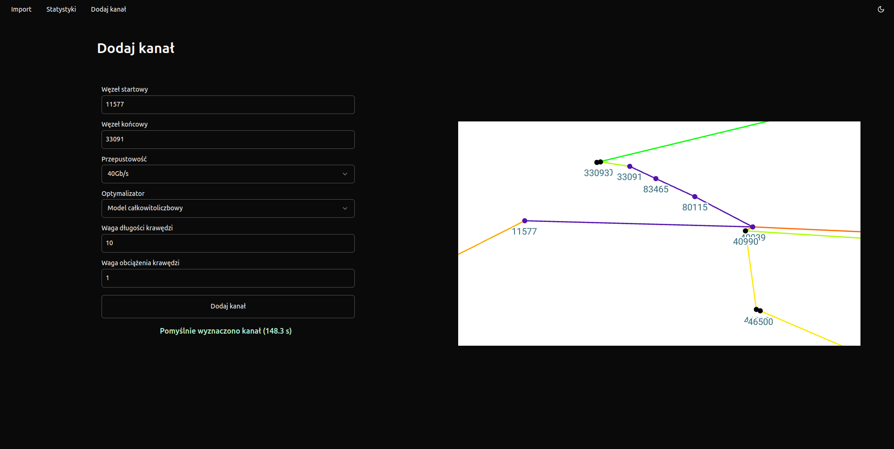{#fig-optimizer-screenshot}

* Po załadowaniu sieci w zakładce "Import" przejdź do zakładki "Dodaj kanał" (widoczna na zrzucie ekranu \ref{fig-optimizer-screenshot})
* W polach "Węzeł startowy" i "Węzeł końcowy" wpisz identyfikatory węzłów, między którymi ma być wyznaczony kanał
  * możesz je odczytać z wizualizacji sieci
  * jeśli sieć jest zbyt duża i identyfikatory nie są widoczne, przybliż wizualizację kółkiem myszy
* Wybierz jedną z opcji w polu "Przepustowość"
  * określa ona, jaką przepustowość ma mieć nowy kanał
* Wybierz jeden z modeli optymalizacyjnych w polu "Optymalizator"
* Model całkowitoliczbowy
  * znajdzie optymalny przebieg kanału, o ile można go wytyczyć przy zadanych parametrach i stanie sieci
  * wyznaczanie kanału może zająć kilka minut
* Algorytm Dijkstry
  * znajduje optymalną ścieżkę znacznie szybciej
  * nie gwarantuje sukcesu we wszystkich przypadkach, które obsłuży model całkowitoliczbowy
* Wprowadź wagi długości i obciążenia krawędzi
  * określają one, jak ważne będą względem siebie te parametry przy wyznaczaniu kanału
* Po wypełnieniu wszystkich opcji naciśnij przycisk "Dodaj kanał" i poczekaj na wynik
* Po pewnym czasie zobaczysz komunikat o wyniku i czasie obliczeń
* Znaleziony kanał zostanie wyróżniony na wizualizacji sieci kolorem fioletowym
* Możesz obejrzeć szczegółowe parametry nowego kanału w zakładce "Statystyki"
* Nowy kanał zostanie również ujęty w raporcie zajętości pasma, który możesz pobrać w zakładce "Statystyki"

\newpage
# Instrukcja dla administratora
Aplikacja jest w pełni skonteneryzowana.

Obsługuje dwa tryby uruchomienia:

* lokalny, w celu testowania i wytwarzania
* produkcyjny, w którym wszystkie kontenery uruchamiane są na jednej maszynie, dostępna przez HTTP

Do uruchomienia lokalnego potrzebne jest jedynie narzędzie Docker.
Wdrożenie produkcyjne przystosowane jest do usługi Microsoft Azure.

Pliki używane do uruchomienia:

1. Lokalnie:
    * frontend/Dockerfile.dev
    * backend/Dockerfile
    * docker-compose.local.yml
    * nginx.local.conf
    * .env.development
2. Produkcyjnie:
    * frontend/Dockerfile.prod
    * backend/Dockerfile
    * docker-compose.prod.yml
    * nginx.prod.conf
    * .env.production


## Wdrożenie produkcyjne

### 1. Stworzenie infrastruktury

Do stworzenia infrastruktury chmurowej wykorzystywane jest narzędzie Terraform. Przygotowany skrypt używa usługi Microsoft Azure.
Aplikacja nie jest uzależniona od tego wyboru. Możliwe jest stworzenie własnej architektury fizycznej lub chmurowej we własnym zakresie.

#### Korzystanie z przygotowanego rozwiązania:

* Wymagane jest posiadanie konta i subskrypcji Microsoft Azure, na której dostępne są co najmniej:
    * Jeden adres publiczny ip
    * Jedna maszyna wirtualna
    * 4 rdzenie procesorów wirtualnych

#### Na własnej maszynie:
* Należy mieć zainstalowane narzędzie AZ (Azure CLI), zalogować się na swoje konto Azure i wybrać subskrypcję, z której korzystać ma aplikacja
* Należy zainstalować narzędzie Terraform
* W pliku terraform.tfvars ustawić zmienną "public_ssh_key_file" na ścieżkę do pliku zawierającego klucz publiczny, który będzie potrzebny
  do pierwszego zalogowania się na maszynę wirtualną (domyślnie: "~/.ssh/id_rsa.pub")
* (opcjonalnie) w pliku main.tf zmienić nazwy i lokalizacje zasobów alokowanych na platformie Azure wedle potrzeb
* W katalogu cloud/terraform wykonać polecenia:

```shell
terraform init
terraform apply
```

### 2. Wdrożenie aplikacji używając Ansible

Do wdrożenia aplikacja na istniejącej infrastrukturze używane jest narzędzie Ansible.

1. Upewnić się, że maszyna wirtualna z adresem publicznym jest uruchomiona
2. W pliku inventory.ini zmienić adres na adres publiczny maszyny wirtualnej
3. W pliku frontend/ngnix.prod.conf i frontend/.env.production zmienić ".*pzsp2.mgarbowski.pl" na adres używany przez maszynę wirtualną
4. W pliku full-deployment.yaml, w zadaniu "Create users and add SSH keys", dopasować listę użytkowników, których chcemy dodać na maszynie
5. Pliki z kluczami publicznymi użytkowników umieścić w katalogu "/cloud/ansible/public_keys/".
   * Nazwa pliku musi odpowiadać nazwie użytkownika zdefiniowanej w poprzednim kroku.

6. Po pierwszym uruchomieniu maszyny administrator operujący kluczem ssh zdefiniowanym przy tworzeniu architektury musi wykonać na swojej maszynie

``` shell  
$user@computer: ~/projekt/cloud/ansible$ ansible-playbook -i inventory.ini  \
    ./full-deployment.yaml --user azureuser
```
W przypadku wykorzystania innego rozwiązania niż Azure należy zastąpić "azureuser" nazwą użytkownika z dostępem do uprawnień root

7. Po każdym kolejnym uruchomieniu zapisani użytkownicy mogą wdrożyć aplikację na nowo poleceniem

``` shell  
$user@computer: ~/projekt/cloud/ansible$ ansible-playbook -i inventory.ini  \
    ./full-deployment.yaml --user {nazwa uzytkownika}
``` 

Aplikacja powinna być teraz dostępna pod adresem http://{adres publiczny maszyny}


### Uwaga!

Jeśli nie pożądane jest, aby wdrażana była najnowsza dostępna wersja aplikacji (https://github.com/mGarbowski/pzsp2-projekt.git), należy zastąpić adres repozytorium
w pliku full-deployment, w zadaniu "Clone the project repository" na własne publiczne repozytorium zawierające pożądaną wersję.
