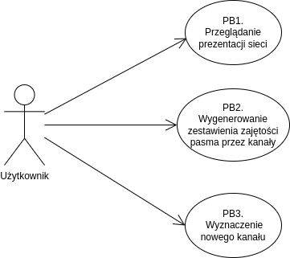
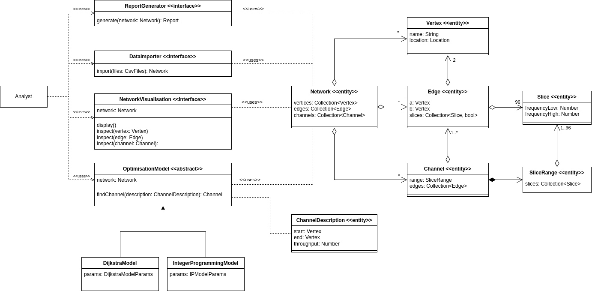

<!-- 
pandoc master.md -o master.pdf \
    --pdf-engine=xelatex \
    --toc \
    --toc-depth=2 \
    --number-sections \
    -V geometry:margin=0.5in \
    -V lang=polish \
    -V babel-lang=polish
-->

---
title: "Sieć"
subtitle: "Dokumentacja projektowa PZSP2"
date: "2024-11-30"
titlepage: true
titlepage-color: "FFFFFF"
titlepage-text-color: "000000"
titlepage-rule-color: "000000"
titlepage-rule-height: 2
---

\newpage

# Wprowadzenie

**Wersja 1.2**

**Zespół nr 2 w składzie**

* Maksym Bieńkowski
* Mikołaj Garbowski
* Michał Łuszczek
* Krzysztof Sokół

**Mentor zespołu: mgr. inż. Klara Borowa**

**Właściciel tematu: dr. inż. Stanisław Kozdrowski**

## Cel projektu {#project-goal}
Celem jest stworzenie aplikacji wspomagającej optymalizację bieżącego ruchu w realistycznej sieci 
teleinformatycznej. Podstawowym zadaniem jest odzwierciedlenie aktualnej zajętości pasma w sieci 
optycznej na podstawie plików z baz danych: w postaci arkusza kalkulacyjnego, jak i w postaci graficznej 
na modelu topologicznym sieci (mapa zajętości). W przeciwieństwie do technologii fixed grid, która 
zakłada równomierny podział pasma między kanały, stosowany model flex grid umożliwia zmienny 
przydział jednostek nazywanych slice'ami. Pozwala to na minimalizację marnowanego pasma, co 
prowadzi do zmniejszenia kosztów dzierżawy włókien przesyłowych. Problem optymalnej rozbudowy 
sieci należy do kategorii NP-trudnych. Naszym celem jest stworzenie aplikacji ułatwiającej zarządzanie 
taką siecią.

**Głównymi celami są**

* czytelna reprezentacja sieci w postaci grafu
* możliwość zestawienia nowych kanałów i automatyczny dobór optymalnych tras zapewniających 
równomierne obciążenie sieci
* generowanie raportów zajętości slice'ów w postaci plików csv
* zaproponowanie modelu w postaci matematycznej, zawierającego funkcję celu (kosztu) oraz zbioru ograniczeń, optymalizującego pasmo oraz ruting nowo-zestawianych kanałów (ścieżek) optycznych w sieci

**Słowik pojęć**

* pasmo - zakres częstotliwości światła, na którym przesyłane są dane
* slice’y - kawałki pasma o różnej rozpiętości częstotliwościowej
* krawędź - para włókien optycznych dzierżawionych przez firmę telekomunikacyjną
* kanał - ścieżka między dwoma wierzchołkami zajmująca tę samą grupę slice'ów na każdej krawędzi
* wierzchołek - punkt rozdzielczy sieci telekomunikacyjnej

## Wstępna wizja projektu

Projekt realizowany jako aplikacja sieciowa.

**Tryb Działania**

* Użytkownik ma do dyspozycji interfejs, na którym wyświetlana jest sieć w postaci grafu.
* Dla polepszenia czytelności graf nałożony będzie na mapę, przez co łatwo będzie identyfikować połączenia.
* Interfejs użytkownika udostępnia narzędzia do modyfikacji modelu sieci i parametrów modeli optymalizacyjnych.
* System dostarcza modeli optymalizacyjnych do wyznaczania nowych kanałów w sieci.

**Dane**

Danymi w projekcie są:

* dostarczony przez użytkownika plik zawierający koordynaty punktów rozdzielczych, istniejące połączenia i kanały
* wewnętrzna reprezentacja grafowa sieci
* wygenerowany raport w formacie csv z informacjami o zajętości slice'ów - informacje o połączeniu, slice i czy jest obecnie używany

System nie będzie trwale przechowywać danych.

\newpage

# Metodologia wytwarzania

* Praca, poza określonymi w harmonogramie konsultacjami, organizowana jest w formie zwinnej.
* Przewidziane są cotygodniowe spotkania zdalne w ramach zespołu, w trakcie których członkowie ustalają priorytety i dzielą się zadaniami.
* Przydział zadań widoczny jest na Github w postaci issues.
* Dodatkowo dostępna jest ciągła komunikacja na platformie discord.

Role w zespole według podziału Belbina

* Mikołaj Grabowski - Shaper, Implementer, Team worker
* Maksym Bieńkowski - Implementer, Resource Investigator, Team Worker
* Michał Łuszczek - Coordinator, Implementer, Team Worker
* Krzysztof Sokół - Implementer, Evaluator

\newpage

# Analiza wymagań {#requirements-analysis}

## Wymagania użytkownika i biznesowe

**Wymagania biznesowe**

Aktorzy: osoba zarządzająca rozkładem połączeń w sieci

1. Próba minimalizacji kosztów wynikających z dzierżawy włókien przesyłowych
2. Ułatwienie rozszerzania sieci o nowe połączenia
3. Rozwiązanie problemu wyboru optymalnej trasy nowego połączenia
4. Ułatwienie administracji siecią
5. Zapewnienie jak największej niezawodności sieci poprzez równomierne rozłożenie obciążeń pozwalające na poprowadzenie alternatywnego połączenia w przypadku zerwania fizycznych węzłów
6. Rozwiązanie problemu identyfikacji najbardziej obciążonych odcinków sieci

**Wymagania użytkowe**

1. Użytkownik powinien mieć możliwość zdefiniowania sieci poprzez przesłanie pliku zawierającego jej reprezentację
2. Użytkownik powinien mieć możliwość wizualnego podglądu zajętości slice’ów poszczególnych krawędzi w sieci
3. Użytkownik powinien mieć możliwość zdefiniowania nowego kanału w sieci o określonej przepustowości łączącego zadane dwa wierzchołki
4. Użytkownik powinien otrzymać optymalne ułożenie nowego kanału w sieci
5. Użytkownik powinien mieć możliwość pobrać plik reprezentujący zajętość pasma na każdym ze zdefiniowanych kanałów w sieci
6. Dane użytkownika nie powinny być dostępne dla innych użytkowników systemu
7. Użytkownik powinien mieć możliwość zmiany parametrów algorytmu optymalizacyjnego.

**Wymagania systemowe**

1. System powinien udostępnić użytkownikowi graficzną reprezentację sieci w formie grafu
2. System powinien móc wyświetlać graf rzutowany na mapę geograficzną obszaru na podstawie współrzędnych poszczególnych węzłów
3. System powinien wyświetlać zajętość slice'ów danej krawędzi po najechaniu na nią myszką
4. System powinien wyświetlać krawędzie w różnych kolorach reprezentujących zajętość pasma
5. System powinien ustalać optymalne ułożenie nowo zdefiniowanego kanału
6. System powinien udostępniać optymalizację ułożenia dodawanego kanału przy pomocy algorytmu Dijkstry
7. System powinien udostępniać optymalizację ułożenia dodawanego kanału przy pomocy modelu całkowitoliczbowego
8. System powinien umożliwić wyeksportowanie reprezentacji sieci w pliku CSV w następującym formacie:
    * Wierszowi tabeli odpowiada pojedynczy kanał
    * Kolumnie tabeli odpowiada pojedynczy slice
    * Zawartością komórki tabeli jest binarna informacja o zajętości kanału w danej ścieżce
9. Reprezentacja sieci w sesji danego użytkownika powinna być widoczna tylko dla niego
10. System powinien umożliwić zapisanie stanu sieci
11. System powinien umożliwić odtworzenie sieci z wcześniej zapisanego stanu

## Wymagania funkcjonalne i niefunkcjonalne

**Wymagania funkcjonalne**

1. Użytkownik powinien mieć możliwość przesłania pliku w formacie `.csv` zawierającego reprezentację sieci.
2. Aplikacja powinna udostępnić użytkownikowi graficzną reprezentację sieci w postaci grafu.
3. Użytkownik powinien mieć możliwość zdefiniowania nowego kanału w sieci łączącej zadane dwa wierzchołki, określając jego przepustowość.
4. Użytkownik powinien mieć możliwość wyświetlania grafu zrzutowanego na mapę geograficzną obszaru na podstawie współrzędnych poszczególnych węzłów.
5. Aplikacja powinna dynamicznie zmieniać kolor krawędzi grafu w zależności od poziomu zajętości slice'ów tej krawędzi.
6. Użytkownik powinien mieć możliwość podglądu szczegółowych danych dotyczących zajętości slice'ów określonej krawędzi poprzez najechanie na nią kursorem.
7. Ułożenie nowych kanałów określane będzie przy pomocy algorytmu optymalizacyjnego.
8. Aplikacja umożliwia optymalizację ułożenia nowego kanału za pomocą algorytmu Dijkstry.
9. Aplikacja umożliwia optymalizację ułożenia nowego kanału przy użyciu modelu całkowitoliczbowego.
10. Użytkownik powinien mieć możliwość zmiany parametrów algorytmu optymalizacyjnego.

**Wymagania niefunkcjonalne**

1. Aplikacja powinna dostarczać wynik optymalizacji ułożenia kanału w czasie nie dłuższym niż 5 minut dla sieci złożonej z nie więcej niż 300 kanałów.

## Przypadki użycia {#use-cases}

**Biznesowe przypadki użycia**

### PB1 Przeglądanie prezentacji sieci

Aktorzy: użytkownik.

Scenariusz główny:

1. System wyświetla graficzną prezentację sieci teletransmisyjnej.
2. System wyświetla zbiorcze statystyki sieci.
3. Użytkownik wybiera element sieci.
4. System wyświetla szczegółowe informacje o elemencie.

### PB2 Wygenerowanie zestawienia zajętości pasma przez kanały

Aktorzy: użytkownik.

Scenariusz główny:

1. Użytkownik wybiera opcję generowania zestawienia dla załadowanej sieci.
2. System generuje zestawienie.
3. Użytkownik pobiera plik z zestawieniem.

### PB3 Wyznaczenie nowego kanału

Aktorzy: użytkownik.

Scenariusz główny:

1. Użytkownik wprowadza parametry dla pożądanego kanału.
2. System prezentuje nowy kanał na wizualizacji sieci.
3. System wyświetla parametry nowego kanału.

Scenariusz alternatywny - system nie może wyznaczyć żądanego kanału:

1. Użytkownik wprowadza parametry dla pożądanego kanału.
2. System informuje użytkownika o niepowodzeniu wyznaczania nowego kanału.
3. System umożliwia ponowne wprowadzenie parametrów - powrót do kroku 1.

**Systemowe przypadki użycia**

### FU1 Wprowadzenie opisu sieci do systemu

Aktorzy: użytkownik.

Scenariusz główny:

1. Użytkownik otwiera widok wprowadzania danych.
2. Użytkownik wybiera plik z opisem sieci (RB1).
3. Użytkownik potwierdza, że chce nadpisać aktualnie załadowaną w systemie sieć.
4. System informuje użytkownika o poprawnym załadowaniu pliku.
5. System wyświetla widok prezentacji załadowanej sieci.

Scenariusz alternatywny - nieprawidłowy plik:

1. Jak w scenariuszu głównym.
2. System informuje użytkownika o nieprawidłowym formacie pliku.
3. System wyświetla informację o akceptowanych formatach (RB1).
4. System umożliwia ponowny wybór pliku - powrót do kroku 1.

### FU2 Przeglądanie prezentacji sieci

Wspiera procedurę PB1 - Przeglądanie prezentacji sieci.

Korzysta z FU1.

Aktorzy: użytkownik.

Scenariusz główny:

1. Użytkownik wprowadza opis sieci za pomocą funkcji FU1.
2. Użytkownik otwiera widok prezentacji sieci.
3. System wyświetla graficzną prezentację topologii sieci i zajętości pasma w krawędziach.
4. System wyświetla zbiorcze statystyki sieci (RB4).
5. Użytkownik wybiera element sieci (węzeł, krawędź, kanał).
6. System wyświetla parametry elementu (RB2, RB3, RB5).

### FU3 Wygenerowanie zestawienia zajętości pasma przez kanały

Wspiera procedurę PB2 - Wygenerowanie zestawienia zajętości pasma przez kanały.

Korzysta z FU1.

Aktorzy: użytkownik.

Scenariusz główny:

1. Użytkownik wprowadza do systemu opis sieci za pomocą funkcji FU1.
2. Użytkownik wybiera widok generowania zestawienia.
3. System generuje plik w ustalonym formacie (RB6).
4. Użytkownik pobiera plik.

### FU4 Wyznaczenie nowego kanału

Wspiera procedurę PB3 - Wyznaczenie nowego kanału.

Korzysta z funkcji FU1.

Aktorzy: użytkownik.

Scenariusz główny:

1. Użytkownik wprowadza opis sieci do systemu za pomocą funkcji FU1.
2. Użytkownik wybiera widok wyznaczania kanału.
3. Użytkownik wybiera model optymalizacyjny (RB7).
4. Użytkownik wprowadza parametry dla modelu (RB7).
5. Użytkownik potwierdza wybór.
6. System sygnalizuje przetwarzanie.
7. System prezentuje znaleziony kanał na wizualizacji.
8. System wyświetla parametry kanału (RB5).

Scenariusz alternatywny - system nie może wyznaczyć żądanego kanału:

1. Jak w scenariuszu głównym.
2. Jak w scenariuszu głównym.
3. Jak w scenariuszu głównym.
4. Jak w scenariuszu głównym.
5. System informuje użytkownika o niepowodzeniu i jego przyczynie.
6. System umożliwia zmianę parametrów i podobną próbę - powrót do kroku 4.

### Reguły biznesowe
TODO: Do uzupełnienia, kiedy dostaniemy przykładowy zbiór od właściciela projektu

### RB1 Format pliku opisującego sieć teletransmisyjną

### RB2 Parametry węzła sieci

### RB3 Parametry krawędzi sieci

### RB4 Zbiorcze statystyki sieci

### RB5 Parametry kanału

### RB6 Format pliku z zestawieniem zajmowanych slice'ów przez kanały

### RB7 Dostępne modele optymalizacyjne i ich parametry

## Potwierdzenie zgodności wymagań

\newpage

# Definicja architektury

Opis architektury projektu w modelu 4+1

## Scenariusze
Przypadki użycia opisane w punkcie \ref{use-cases} dokumentacji.

## Widok logiczny

* Rysunek \ref{fig:logical-view} przedstawia diagram klas
* Użytkownik (analityk) korzysta z interfejsów do
    * wprowadzania opisu sieci do systemu
    * przeglądania prezentacji sieci
    * generowania raportu zajętości pasma przez kanały
    * wyznaczanie nowego kanału z użyciem modelu optymalizacyjnego
* System dostarcza 2 modeli optymalizacyjnych
    * oparty o algorytm Dijkstry
    * oparty o model programowania całkowitoliczbowego
* Pojęcia użyte w modelu sieci są objaśnione w punkcie \ref{project-goal} dokumentacji

## Widok procesu

* Diagram \ref{fig:process-view} przedstawia typowe użycie systemu
* Użytkownik zaczyna od wprowadzenia opisu sieci
* Dla załadowanej sieci użytkownik może
    * obejrzeć jej wizualizację i przeglądać parametry jej elementów
    * wygenerować raport na podstawie aktualnie załadowanej sieci
    * zestawić nowy kanał w sieci wykorzystując model optymalizacyjny 

## Widok implementacji

* Rysunek \ref{fig:development-view} przedstawia diagram komponentów
* Aplikacja webowa dostarcza widoków użytkownika do
    * importu opisu sieci z plików .csv
    * przeglądania graficznej prezentacji sieci (wizualizacja sieci i podgląd statystyk wybranych elementów)
    * generowania raportów w formacie .csv
    * korzystania z modeli optymalizacyjnych
* Modele optymalizacyjne są zaimplementowane po stronie serwera
    * API Controller przyjmuje żądania, zleca przeprowadzenie optymalizacji i odsyła wynik

W implementacji podsystemu `WebApp` planujemy wykorzystać framework React (Typescript) i bibliotekę 
do wizualizacji grafów (do ustalenia).

W implementacji podsystemu `OptimisationBackend` planujemy wykorzystać framework FastAPI (Python), 
bibliotekę Pyomo oraz solwer dla modeli programowania całkowitoliczbowego (do ustalenia). 

Do zweryfikowania pozostaje kwestia, czy istnieje solwer na licencji Open Source, który obsłuży 
nasz model całkowitoliczbowy i zbiór danych.
Alternatywnie możemy wykorzystać oprogramowanie AMPL, w środowisku chmurowym dostępnym dla PW, 
na który licencję może udostępnić nam właściciel tematu.

## Widok fizyczny

* Rysunek \ref{fig:physical-view} przedstawia diagram wdrożenia
* Aplikacja będzie wdrożona na jednym serwerze
    * przyjmujemy roboczo, że będzie to Raspberry Pi
* Aplikacja jest uruchamiana w środowisku Docker
* Kontener `backend`
    * artefakty obejmują kod źródłowy aplikacji wykorzystującej framework FastAPI oraz implementację modeli optymalizacyjnych.
    * realizuje funkcje podsystemu `Optimisation Backend`
* Kontener `web-server`
    * serwer HTTP Nginx
    * serwuje aplikację webową realizującą funkcje podsystemu `WebApp`
    * służy jako reverse proxy dla klientów komunikujących się z podsystemem `Optimisation Backend`
    * artefakty to kod zbudowanej aplikacji webowej oraz pliki konfiguracyjne serwera Nginx
* Kontenery będą połączone w jednym *docker network*
* Schemat komunikacji klient-serwer
    * klient wysyła żądanie użycia modelu optymalizacyjnego z danymi wejściowymi (opis sieci, opis żądanego kanału)
    * serwer odpowiada, że przyjął żądanie
    * serwer uruchamia model optymalizacyjny (czas przetwarzania rzędu kilku minut)
    * serwer odsyła klientowi wynik optymalizacji (parametry nowego kanału)

Ze względu na długi czas przetwarzania po stronie serwera, chcemy zastosować protokół WebSockets, 
który umożliwi dwustronną komunikację, w której serwer odeśle wynik, kiedy będzie gotowy. 
W ten sposób unikniemy cyklicznego odpytywania serwera przez klienta (polling).

Powyższy plan wymagałby zmiany, jeśli skorzystamy z licencji na program AMPL w środowisku 
OpenStack Zakładu Sztucznej Inteligencji Instytutu Informatyki (planujemy jednak, o ile to możliwe, 
wykorzystać rozwiązania Open Source).

{#fig:logical-view}

{#fig:process-view}

{#fig:development-view}

{#fig:physical-view}

\newpage

# Dane trwałe
W naszym projekcie nie przewidujemy użycia bazy danych.

Model sieci teleinformatycznej (wraz ze wszystkimi zmianami) będzie przechowywany po stronie aplikacji przeglądarkowej 
do momentu zamknięcia lub odświeżania strony. Po tym okresie konieczne będzie ponowne wgranie opisu. 
Po stronie serwera nie są przechowywane stale żadne dane. Działa on jak funkcja, która otrzymuje model sieci 
i parametry optymalizatora, oblicza optymalną trasę kanału, zwraca ją aplikacji przeglądarkowej, 
a następnie usuwa te dane, wracając do stanu początkowego.

Formaty plików wejściowych są opisane w punkcie \ref{requirements-analysis}.

\newpage

# Specyfikacja analityczna i projektowa

## Repozytorium kodu źródłowego
[https://github.com/mGarbowski/pzsp2-projekt](https://github.com/mGarbowski/pzsp2-projekt)

## Wykorzystane technologie
* Języki programowania
  * Python
  * Typescript
* Biblioteki
  * FastAPI
  * Pyomo
  * React
  * cbc
* Środowiska
  * Docker

## Diagram klas
Dotyczy kolejnych etapów projektu.

## Statystyki
<!--
Liczba plików
sum=$(( $(find backend/src -type f \( -name "*.py" \) | wc -l) + $(find backend/tests -type f \( -name "*.py" \) | wc -l) + $(find frontend/src -type f \( -name "*.ts" -o -name "*.tsx" \) | wc -l) ))
echo $sum

Liczba linii kodu
find frontend/src -name "*.tsx" | xargs wc -l | tail -n 1
find frontend/src -name "*.ts" | xargs wc -l | tail -n 1
find backend/src -name "*.py" | xargs wc -l | tail -n 1

Liczba testów
npm test
pdm test
-->

* Liczba plików z kodem źródłowym: 56
* Liczba linii kodu źródłowego: 3715
* Liczba testów jednostkowych: 33

\newpage

# Projekt standardu interfejsu użytkownika

## Aktorzy

Użytkownik aplikacji - analityk sieci teleinformatycznej w dużej firmie telekomunikacyjnej

## Historyjki użytkownika

1. Jako analityk sieci teleinformatycznej chcę wizualizować istniejący graf połączeń i ich zajętości w sieci, aby łatwo zrozumieć strukturę połączeń i zidentyfikować potencjalne problemy
2. Jako analityk sieci teleinformatycznej chcę, aby optymalne ścieżki nowych kanałów były automatycznie wyznaczane, aby uniknąć ręcznej analizy i zapewnić efektywne wykorzystanie pasma
3. Jako analityk sieci teleinformatycznej chcę łatwo wygenerować raporty o zajętości kanałów w istniejącej sieci, aby monitorować obciążenie sieci i zapobiegać ewentualnym przeciążeniom
4. Jako analityk sieci teleinformatycznej, chcę mieć łatwy i intuicyjny dostęp do danych o obciążeniu dowolnego elementu w sieci, aby zidentyfikować słabe punkty i wąskie gardła systemu.
5. Jako analityk sieci teleinformatycznej, chcę optymalnie wykorzystywać przepustowość sieci, aby zminimalizować koszty ponoszone przez moją firmę i zapewnić, że sieć będzie gotowa na dalsze rozszerzenia.

## Makiety interfejsu użytkownika
Makiety trzech proponowanych widoków w programie Figma dostępne są do podglądu pod [(tym URL)](https://www.figma.com/design/LSVdFyCmJqtZo8UsO2cd5q/PZPS2_2024?node-id=0-1&t=1bl4m1dv9aWKn0LJ-1)

